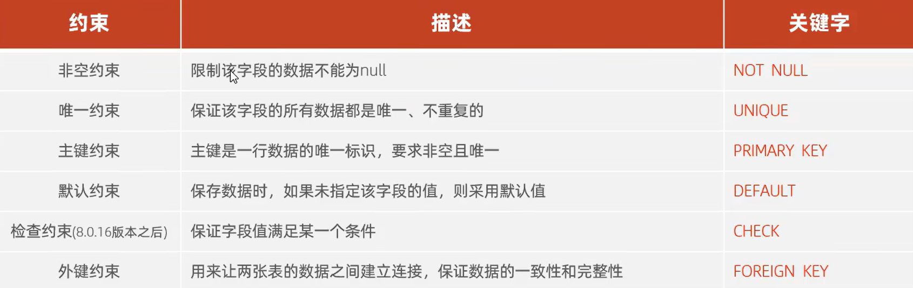
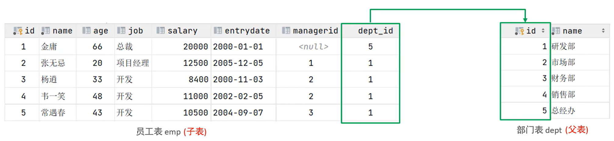
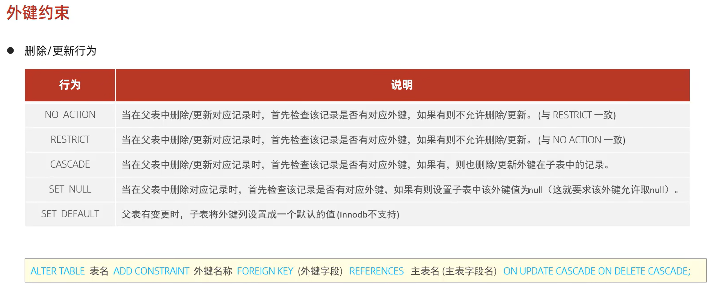

### MYSQL--约束

**约束是作用于表中字段上的，可以在创建表、修改表时添加约束**



#### *1.非空约束*
：限制该字段不为null
```
id int not null;
```

#### *2.唯一约束*
：该字段的所有数据都是唯一的
```
name varchar(10) unique;
```

#### *3.主键约束*
```
id int primary key;
```

#### *4.默认约束*
：未指定该字段的值则用默认值
```
id int default '1';
//默认为1
```

#### *5.检查约束*
：保证该字段满足某一个条件
```
age int check( age>0 && age <=100);
//保证年龄在0和100岁之间
```

#### *6.设置该字段自增*
```
id int auto_increment;
//将ID设置为自增
//如 1 2 3
```

#### *7.外键约束*
：用来让两张表的数据之间建立连接，从而保证数据的一致性和完整性



##### *①添加外键语法：*
```
alter table 表名 add constraint 外键名字 foreign key(外键字段名字) references 主表(主表列名);
```
```
alter table emp add constraint fk_emp_dept_id foreign key(dept_id) references dept(id);
```
##### *②删除外键语法：*
```
alter table 表名字 drop foreign key 外键名字;
```
```
alter table emp drop foreign key fk_emp_dept_id;
```

##### *③外键更新约束行为：*




