##  web前端
### 1.HTML：负责网页的结构(页面元素和内容)
### 2.CSS：负责网页的表现(页面元素的外观，位置等页面样式，如：颜色，大小等)
### 3.JavaScript：负责网页的行为(交互效果)

## 一. HTML与CSS
### 1.标题标签
标签：
```html
标题标签：<h1>..</h1>
(h1->h6 重要程度程度依次降低)
```
注意：html标签都是预定义好的，不能自己随意定义

### 2.水平线标签
```
<hr>
```

###  3.图片标签
```html

```
绝对路径：绝对磁盘路径(D:/xxx) 绝对网络路径(http://xxx)
相对路径：从当前文件开始查找。(./:当前路径,../:上一级路径)

*相关语句：*
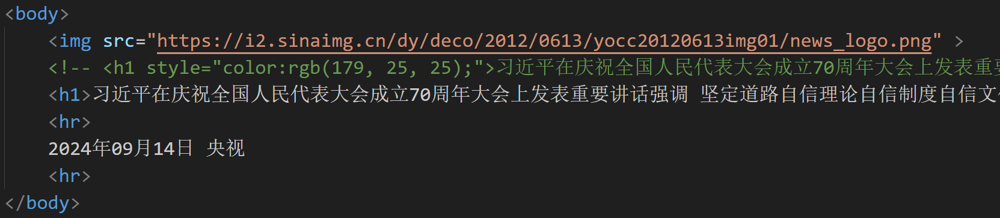
```html
<body>
     国内新闻 > 正文
    <!-- <h1 style="color:rgb(179, 25, 25);">习近平在庆祝全国人民代表大会成立70周年大会上发表重要讲话强调 坚定道路自信理论自信制度自信文化自信 继续把人民代表大会制度坚持好完善好运行好</h1> -->
    <h1>习近平在庆祝全国人民代表大会成立70周年大会上发表重要讲话强调 坚定道路自信理论自信制度自信文化自信 继续把人民代表大会制度坚持好完善好运行好</h1>
    <hr>
    <span>2024年09月14日</span> <span>央视</span> 
    <hr>
</body>

```
*效果*
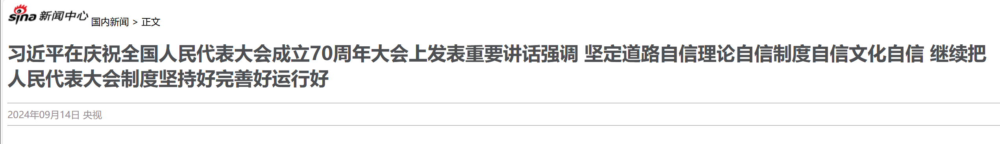
### CSS引入方式
1. 行内样式：
``` html
<h1 style="..."></h1>
```
2. 内嵌样式：
```html
<style></style>
```
3. 外联样式：
```html
xxx.css
<link href="...">
```

### 颜色表示
1. 关键字： red,green...
2. rgb表示法：rgb(255,0,0)...
3. 十六进制： #ff0000...


### CSS属性
#### 颜色属性
color:设置文本内容的颜色
*相关语句*
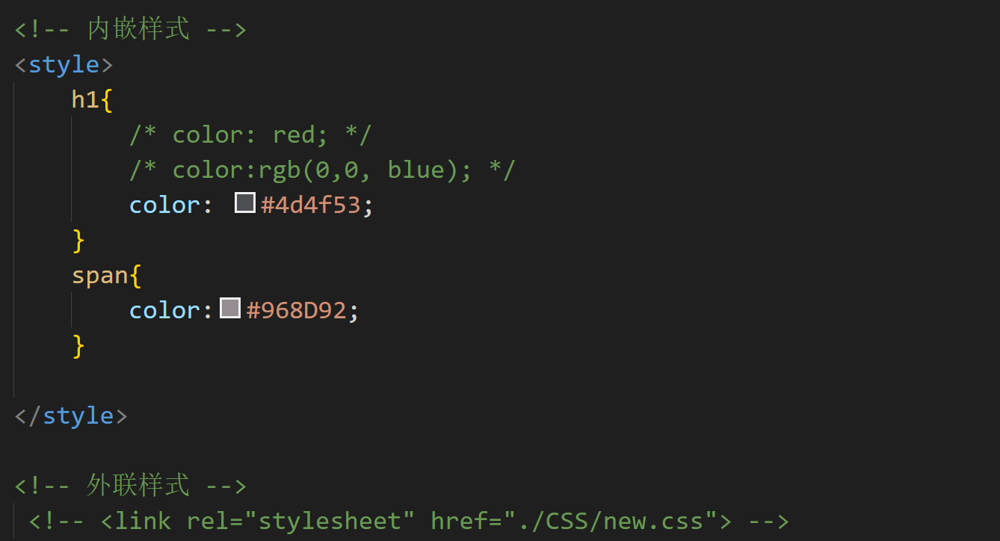
```css
外联方式：CSS文件
h1{
    color:red;
}
```

```html
    <!-- 内嵌样式 -->
    <style>
        h1{
            /* color: red; */
            /* color:rgb(0,0, blue); */
            color: #4d4f53;
        }
        span{
            color:#968D92;
        }

    </style>

    <!-- 外联样式 -->
    <link rel="stylesheet" href="./CSS/new.css">
```
#### 字体属性
cont-size:设置字体大小(注意：记得加px)

```html
<style>
        #time{
            font-size: 13px;  /* 设置字体大小 */
        }
    </style>
```
#### 文本修饰
text-decoration:规定到文本修饰，none表示定义标准的文本。
```html
        a{
            text-decoration: none; /*设置一个标准的文本*/
        }
```
#### 段落设置
**line-height:** 设置行高
**text-indent:** 定义第一个行内容的缩进
**text-align:** 规定元素中文本的水平对齐方式
```html
    <style>
        p{
            text-indent: 35px; /* 设置首行缩进 */
            line-height: 30px;/* 设置行高 */
        } 
        #plast{ 
            text-align: right;/* 对齐方式 */
        }
        </style>
```


### \<span>标签
\<span>标签 是一个在开发网页时大量会用到的没有予以的布局标签
特点：遗憾顾客是现实多个(组合行内元素)，宽度和高度默认由内容撑开

### CSS选择器
1. 元素选择器
2. id选择器
3. 类选择器  

```html
    <!-- 内嵌样式 -->
    <style>
        /* 元素选择器 */
        span{
            color:#968D92;
        }

        /* 类选择器 */
        .cls{
            color: #968D92;
        }
    
        /* ID选择器 */
        #time{
            color: #968D92;
            font-size: 13px;  /* 设置字体大小 */
        }
    <body>
        <span class="cls" id="time">2024年09月14日</span> <span>央视</span> 
    <\body>
```
**优先级：
id选择器>类选择器>素选择器**

### 超链接
标签：\<a>
属性：
1. href:指定资源访问url  
2. target:指定在何处打开资源链接  
_self:默认值，在当前页面打开  
_blank:新建页面打开  
```html
<a href="https://news.sina.com.cn/china/" target="_self">国内新闻</a>

```

### 视频,音频标签
**\<video>**
**\<audio>**
 src：规定视频的url
 controls:显示播放控件
 width：播放器的宽度
 height:播放器的高度

###  换行，段落标签
换行：**\<br>**
段落：**\<p>**

### 文本加粗标签
```html
<b>
<strong>
```

### 空格输入
在html中无论输入多少个空格，只会显示一个 。可以使用空格占位符：**\&nbsp;**

### 布局标签
在实际开发网页中，会大量频繁的使用div和span这两个没有语义的布局标签
**1. div标签：**  
   一行只显示一个(独占一行)
   宽度默认是父元素的宽度，高度默认由内容展开
   可以设置宽高(width,height)
**2. span标签：**  
    一行可以显示多个
    宽度和高度默认由内容撑开
    不可设置宽高

#### 1.盒子模型
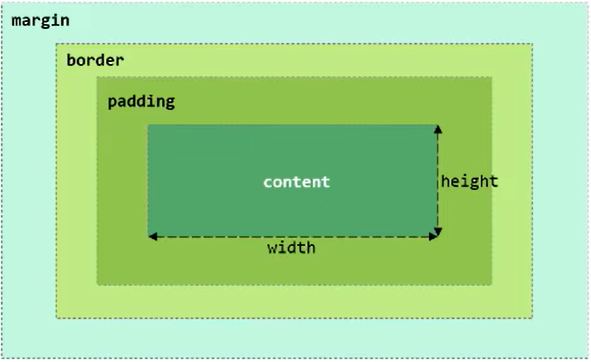
组成：内容(content),内边距(padding),边框(border),外边距(margin)
#### 2.设置页面整体布局CSS属性
**width:** 设置宽度
**height：** 设置高度
**border:** 设置边框的属性，如：1px,solid #000;
**padding:** 内边距
**margin:** 外边距
```html
<style>

    /* 居中展示 */
    #center{
        width: 65%;     /* 设宽度 */
        /* margin: 0% 17.5% 0% 17.5%;  上   右   下   左 */
        margin: 0 auto;
    }
</style>
```
### 表格标签
如：班级表
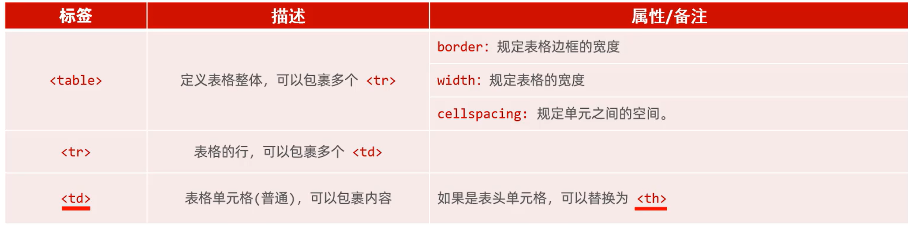
**定义表格：**
```html
<table>

</table>
```
**定义表格中的行，一个tr表示一行**
```html
<tr>

</tr>

```
**定义每一行的每一个内容单元格，具有加粗居中效果，一般为表头**
```html
<th>

</th>
```
**定义普通的单元格**
```html
<td>

</td>
```
### 表单标签
**场景:** 在网页中主要负责数据采集功能，如注册，登录等数据采集


**标签：**
```html
<form action:"" method="">
    用户名：<input type="text" name="username">
    年龄：<input type="text" name="age">

    <input type="submit" value="提交">  
</form>
```
*样式如图*
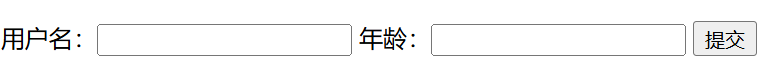
**form表单属性：**
1. **action:** 表单提交的url,往何处提交数据，如果不指定，默认提交到当前页面
2. **method:** 表单提交方式
   get:在 url后面拼接表单数据，如：？username=Tom&age=12,url长度有限制。get为默认值
   post:在消息体(请求体)中传递的，参数大小无限制
   注意：表单项必须有name属性才可以提交
### 表单标签的单项设置
**\<input>:** 表单项，通过type属性控制输入形式
**\<select>:** 定义下拉列表，\<option>定义列表项
**\<textarea>:** 文本域
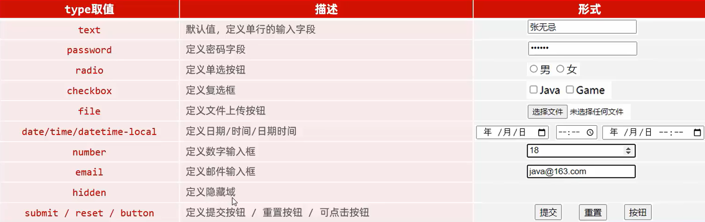

## 二. JavaScript
### 什么是JS
1. 是一门跨平台，面向对象的脚本语言，是用来控制网页而行为的，他能是网页交互
2. JS和Java是完全不同的语言，不论是概念还是设计 ，但是基础语法类似
3. JS在1995年由Brendan Eich发明，并于1997年成为ECMA标准
4. ECMAScript 6(ES6)是最新的JavaScript版本
### JavaScript引入方式
1. **内部脚本：** 将JS代码定义在HTML页面中
   JS代码必须在\<script>\</script>标签之间；
   在HTML文档中，可以在任意地方，防止任意数量的\<script>；
    一般会把脚本置于body元素的底部，可改善显示速度；
```html
<script>
    alert("hello javascript")
</script>
```
2. **外部脚本：** 将JS代码定义在外部JS文件中，然后引入到HTML页面中
   外部JS文件只包含JS代码，不包含\<script>\</script>标签 

*外部定义：*
```js
alert("hello JS")
```
*html引用*
```html
<script src="目录"></script>
```
### JS基础语法
#### 1. 大小写：
与Java一样，变量名，函数名一集其他一切东西都是区分大小写的
#### 2. 分号
每行结尾的分号可有可无，最好加上
#### 3. 注释：
   单行注释：//注释内容
   多行注释：/* 注释内容 */
#### 4. 大括号表示代码块
```js
//判断
if(count==3){
    alert(count);
}
```
#### 输出语句
1. 使用window.alert()写入警告框
2. 使用document.write()写入HTML输出
3. 使用console.log()写入浏览器控制台
```html
<script>
    window.alert("hello javascript");

    document.write("hello js");

    console.log("hello js");
</script>
```
*效果如图*
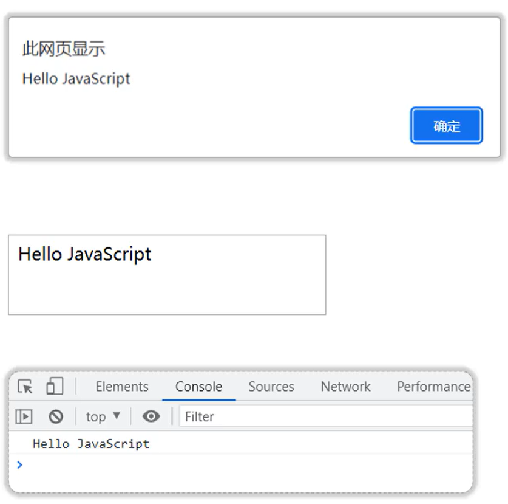
#### 变量
1. 用var 关键字来生命变量
2. JS是一门弱类型语言，变量可以存放不同的类型的值

类似Python
```html
<script>
    var a=10;
    a="你好"；
</script>
```


#### 数据类型
JavaScript分为：**原始类型**和**引用类型**
***原始类型：***
**number ：** 数字
**string：** 字符串，单双皆可
**boolean：** 布尔
**null：** 空
**undefined：** 当生命的遍历啊各位初始化时，该变量的默认值是undefined
使用 *typeof* 可以获取数据类型

#### 流程控制语句
**if...else if ...else...
switch
for 
while
do...while**
### 函数(方法)
```js
//方法一：
function add(a,b){
    return a+b;
}
//方法二：
var add(a,b){
    return a+b;
}
```
### js对象
#### 1.Array数组对象
用Array定义数组
*定义*
```js
//方式一
var a=new Array(1,2,3,3);
//方式二
var b=[1,2,3,4];
```
js中数组类似于python中的列表，可以存储多种类型的数据
##### 属性
**length** 返回数组中元素的数量
```js
var a=[1,2,3]
console.log(a.length)
```
##### 方法
**forEach():** 遍历数组中有值的元素
```js
//方法一
a.forEach(function(e){
    console.log(e);
})

//方法二
a.forEach((e)=>{
    console.log(e);
})
//类似于lambda表达式(python)
//lambda e:print(e)
```
**puss():** 将新元素添加到数组的末尾，并返回新的长度
```js
arr.push(1,2,3);
```

**splice():** 从数组中删除元素
```js
a.splice(2,2);
//(从索引位置开始删除，一共删除几个元素)
```
#### 2.String 字符串
创建方式
```js
//第一种
var str=new String("hello js");
//第二种
var str="js";
```
##### 属性
length
##### 方法
charAt()  返回在指定位置的字符
```js
str.charAt(4);
```
indexOf()  检索字符串
```js
str.indexOf("l");
```
trim()   去除字符串两边的空格
```js
var s=str.trim();
```
substring()  索引字符串
```js
s.substring(0,5);
```
#### 自定义对象
定义格式：
```js
var user={
    name:"Tom",
    age:20.
    gender:"male",
    // eat: function(){
    //     alert("hello js");
    // }
    eat(){
        alert("hello js");
    }
}
```
调用格式
```js
user.name;
user.eat();
```
### JSON
json的定义
JSON与JS对象的相互转换

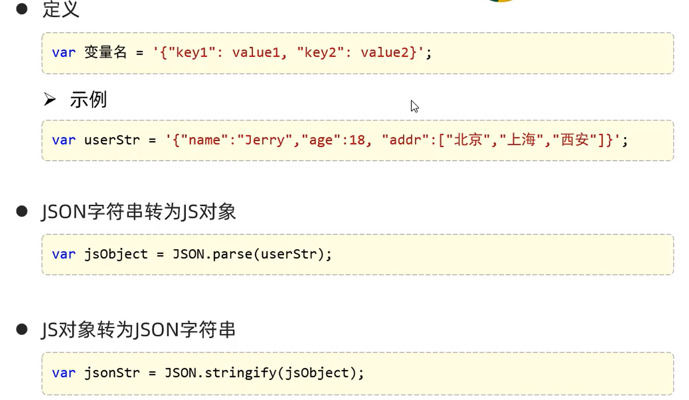

### BOM

#### windows
***获取***
```js
window.alert("hello BOM");
```
***方法***

confirm-对话框--确认：true,取消：false
```js
var flag=confirm("您确认删除该记录吗？");
```
setInterval--定时器-周期性的执行某一个函数
```js
var i=0;
setInterval(function(){
    i++;
    console.log("定时器执行了"+i+"次");
},2000);
```
setTimeout--定时器--延迟指定时间执行一次
```js
setTimeout(function(){
    alert("js");
},3000);
```
location 
地址栏对象
使用Windows.location 获取，其中window.可以省略
href：设置或返回完整的url
```js
alert(location.href);
location.href="https://www.bilibili.com";
//直接跳转到该网站
```

### DOM
概念：文档对象模型
将标记的语言的各个组成部分封装为对应的对象
JS通过DOM，就能够对HTML进行操作：
1. 改变HTML元素的内容
2. 改变HTML元素的样式(CSS)
3. 对HTML DOM事件作出反应
4. 添加和删除HTML元素

**获取Element元素**
1. 根据ID获取
```js
var img=document.getElementById('h1');
alert(img);
```
2. 根据标签获取-div
```js
var divs=document.getElementsByTagName('div');

```

3. 根据name属性获取
```js
var ins=document.getElementsByName('hobby')
//ins 为数组
```

4. 根据class属性获取
``` js
var divs=document.getElementsByClassName('cls');
```
之后查询网站可以进行对元素进行修改
w3school.com.cn

### 事件监听
#### 事件绑定
**方式一**：通过HTML标签中的事件属性进行绑定
```html
<body>
    <input type="button" onclick="on()" value="按钮1"> 
</body>
<script>
    function on(){
        alert("按钮一被点击了");
    }
</script>
```
**方式二** ：通过DOM元素属性绑定
```html
<body>
    <input type="button" id="btn" value="按钮2">
</body>
<script>
    document.getElementById('btn').onclick=function(){
        alert("按钮二被点击了");
    }
</script>
```
相关事件：
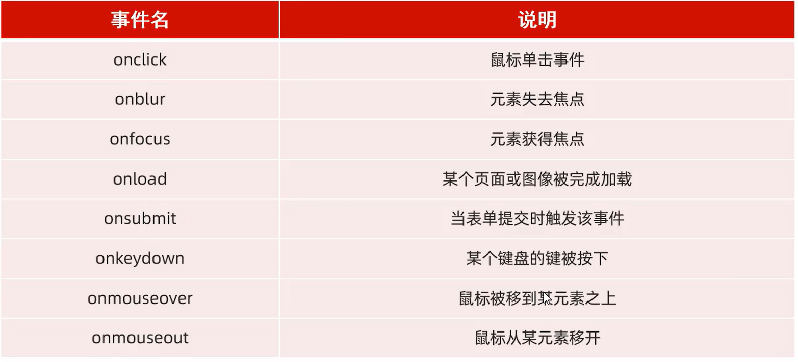
```html
dom小案例
<body><div id="center">
     <br><br>
    <input type="button" value="点亮" onclick="on()">
    <input type="button" value="熄灭" onclick="off()">
    <br><br>
    <input type="text" id="name" value="THIS IS A LIGHT" onfocus="lower()" onblur="upper()">
    <br><br>
    <input type="checkbox" name="hobby">python
    <input type="checkbox" name = "hobby">java
    <input type="checkbox" name="hobby">js 
    <br><br>
    <input type="button" value="全选" onclick="checkAll()">
    <input type="button" value="反选" onclick="reverse()">
</div></body>

<script>
    function on() {  
        var img = document.getElementById("light");  
        img.src="./img/on.png"
    }  
    function off() {  
        var img = document.getElementById("light");  
        img.src="./img/off.png"
    }
    function lower(){
        var msg=document.getElementById("name");
        msg.value=msg.value.toLowerCase();
    }  
    function upper(){
        var msg=document.getElementById("name");
        msg.value=msg.value.toUpperCase();
    }
    function checkAll(){
        var hobbys=document.getElementsByName("hobby");
        for (let i = 0; i < hobbys.length; i++) {
            const element = hobbys[i];
            element.checked=true;            
        }
    }
    function reverse(){
        var hobbys=document.getElementsByName("hobby");
        for (let i = 0; i < hobbys.length; i++) {
            const element = hobbys[i];
            element.checked=false;
        }
    }
</script>
```
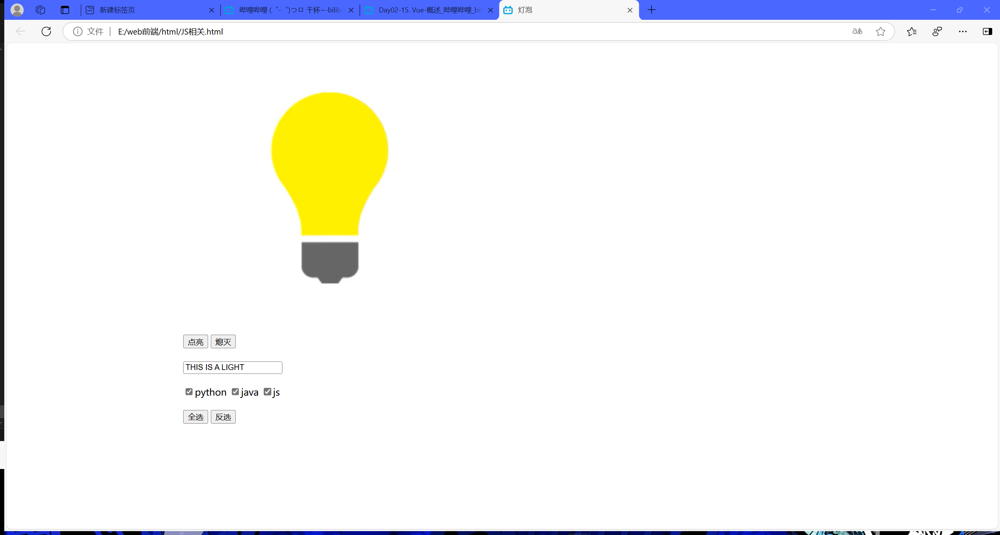


